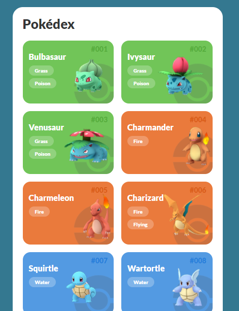
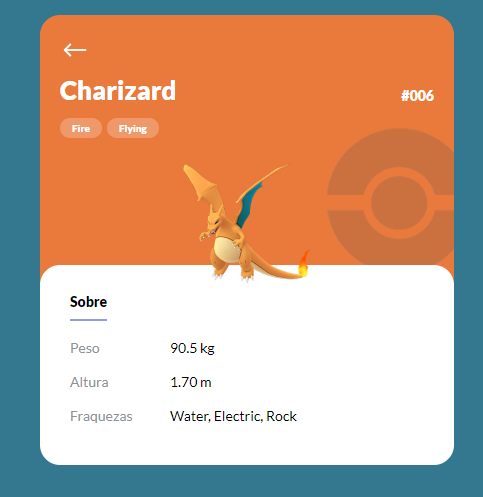

## POKÉDEX

Esse app lista todos os 151 pokémons e ao selecionar um você é redirecionado à página com mais detalhes desse pokémon.




### 📋 Pré-requisitos

```
NodeJs 14.0.0
NPM 6.14.4
```

## 🚀 Começando

Execute os seguintes comandos para executar o app em sua máquina:
```bash
#Clonar repositório
$git clone https://github.com/douglashbr/pokedex
#Acessar diretório do repositório clonado
$cd pokedex
#Instalar as dependências do projeto
$npm i
#Iniciar a aplicação
$npm start
```

## 🛠️ Construído com

Ferramentas que foram utilizadas nesse projeto

* [NPM](https://www.npmjs.com/)
* [ReactJs](https://pt-br.reactjs.org/)
* [React-router-dom](https://reactrouter.com/web/guides/quick-start)
* [Axios](https://github.com/axios/axios)
* [React-icons](https://react-icons.github.io/react-icons/)
* [Styled-components](https://styled-components.com/)
* [Polished](https://polished.js.org/)

## 📄 Licença

Este projeto está sob a licença MIT.

---
⌨️ com ❤️ por [Douglas Dantas](https://github.com/douglashbr) 😊